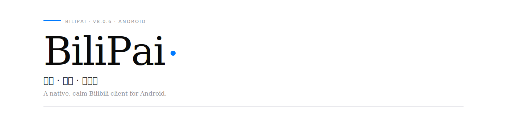
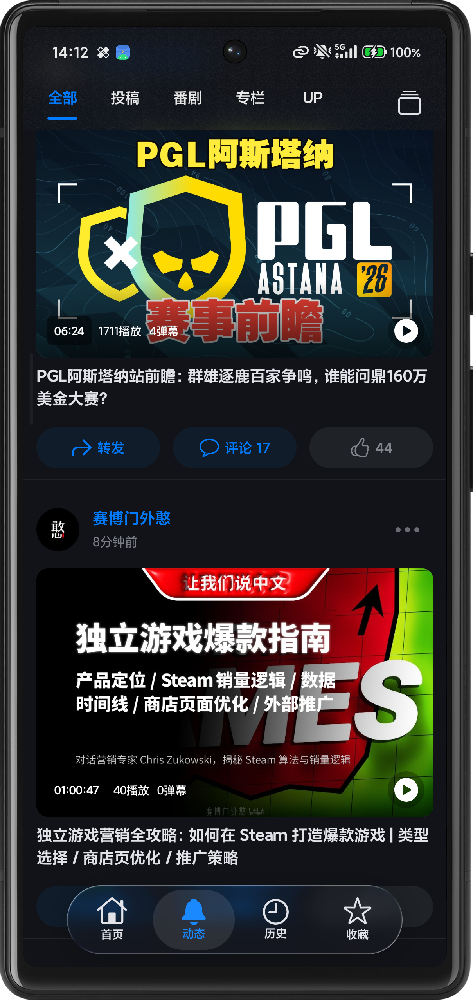
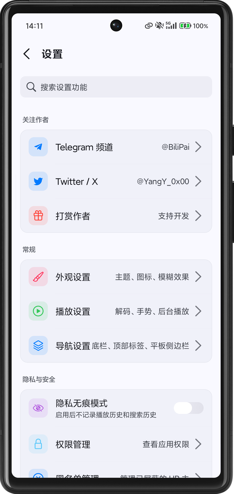
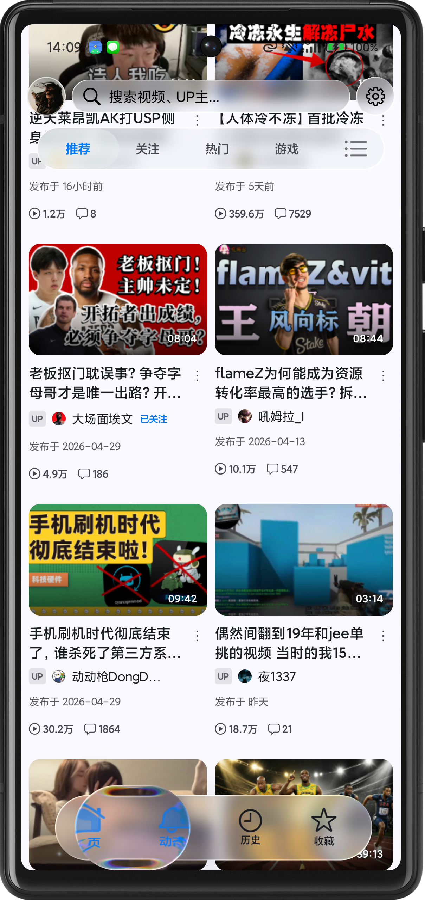

<div align="center">



<br/>

<sub><a href="README.md">中文</a> &nbsp;·&nbsp; <a href="README_EN.md">English</a> &nbsp;·&nbsp; <a href="docs/wiki/README_v8.0.6_legacy.md">Legacy README</a></sub>

<br/><br/>

<a href="https://github.com/jay3-yy/BiliPai/releases"></a>
&nbsp;

&nbsp;

&nbsp;


</div>

<br/>

> 一个原生的 B 站 Android 客户端。回归界面该有的安静与克制 ——
> 没有广告，没有冗余推荐，每一处动效与触感都经过反复打磨。

<br/>

## 设计哲学

BiliPai 在 Material You 与 Apple Human Interface Guidelines 之间寻找平衡点。
它不是简单地"把 iOS 抄到 Android"，而是从两套语言中各取其长 ——
Material 提供的色彩响应与系统协作，加上 iOS 教给我们的层次、节奏与触感。

<table>
<tr>
<td width="33%" valign="top">

**Liquid Glass**

底栏、卡片、播放器面板接入毛玻璃模糊层，背景内容随滚动微动。OLED 与浅色壁纸下都保持清晰与质感。

<sub>由 Haze · AndroidLiquidGlass 提供</sub>

</td>
<td width="33%" valign="top">

**Capsule Tab Bar**

底部 Tab 采用胶囊指示器与模糊背景层，切换附带阻尼弹簧动画。平板与折叠屏上自动切换为侧边栏。

<sub>v8.0.6 起全面接入</sub>

</td>
<td width="33%" valign="top">

**Material 3 Expressive**

新增 MD3E 子主题：动态 shape、表达性 typography 与 motion 三件套。覆盖顶栏、底栏、首页分类与视频设置。

<sub>2026-05 落地</sub>

</td>
</tr>
</table>

<br/>

## 应用预览

<sub>v8.0.6 真机截图 · 深色 / 浅色双主题</sub>

<div align="center">

<table>
<tr>
<td align="center" width="33%">
  <br/>
  <sub>首页推荐</sub>
</td>
<td align="center" width="33%">
  <br/>
  <sub>视频播放 · AI 总结</sub>
</td>
<td align="center" width="33%">
  <br/>
  <sub>动态页</sub>
</td>
</tr>
<tr>
<td align="center" width="33%">
  <br/>
  <sub>设置中心 · 浅色</sub>
</td>
<td align="center" width="33%">
  <br/>
  <sub>浏览流</sub>
</td>
<td align="center" width="33%">
  <br/>
  <sub>双列瀑布</sub>
</td>
</tr>
</table>

</div>

<br/>

## 功能

#### 视频与音频

4K · 1080P60 · HDR · Dolby Vision 全画质支持。DASH 自适应码率，倍速 0.5×–2.0× 支持长按上滑锁定。听视频模式提供沉浸式与黑胶唱片切换、歌词、播放列表与定时关闭。画中画、后台播放、锁屏控制全链路打通。

#### 浏览与搜索

首页推荐、动态、消息、个人空间均为原生实现。300ms 防抖搜索建议、UP 空间内搜索、视频 BGM 识别。图片预览采用 iOS 风格的开关动画与立体过渡。

#### 离线与下载

按清晰度选择下载，音视频自动合并。断点续传，本地播放管理。

#### 隐私

无广告，无追踪，权限最小化。登录凭证仅存本地，运行日志默认不落盘，遥测默认仅崩溃追踪 —— 使用统计默认关闭。

<br/>

<details>
<summary>查看完整功能矩阵</summary>

<br/>

#### 视频播放

| | |
|-----|-----|
| 高清画质 | 4K · 1080P60 · HDR · Dolby Vision (需登录/大会员) |
| DASH 流媒体 | 自适应码率，无缝切换画质 |
| 弹幕系统 | 透明度、字体、滚动速度、密度过滤 |
| 手势控制 | 左侧亮度，右侧音量，左右快进/快退 |
| 倍速 | 0.5× – 2.0×，长按倍速支持上滑锁定 |
| 画中画 | 悬浮小窗，多任务无缝切换 |
| 听视频 | 沉浸式 / 黑胶唱片，歌词、播放列表、定时关闭 |
| AI 总结 | 智能生成视频内容摘要 |
| 原地播放 | 长按封面预览，点击全屏 |
| 后台播放 | 锁屏继续，独立开关与音频焦点 |
| 播放顺序 | 暂停 / 顺序 / 单循环 / 列表循环 / 自动连播 |
| Seek 预览 | 按帧边界量化，重绘负担更低 |
| 评论体验 | 默认排序偏好，长按选择复制 |
| 横屏信息 | 全屏顶部时间显示，交互信息更完整 |
| 播放记忆 | 自动续播，同目标仅提醒一次 |

#### 番剧 · 直播 · 动态

| | |
|-----|-----|
| 番剧首页 | 热门推荐、新番时间表、分区浏览 |
| 选集面板 | 官方风格底部弹出，季度/版本切换 |
| 直播 | HLS 自适应码率，实时弹幕，动态卡片直达 |
| 动态流 | 视频/图文/转发，分类筛选，GIF 完美渲染 |
| 图片预览 | 全局 Overlay + iOS 风格开关动画，立体过渡 |
| @ 高亮 | 动态中 @用户 自动高亮 |

#### 消息中心 · 个人

| | |
|-----|-----|
| 消息中心 | 回复 / @ / 赞 / 系统通知，统一入口 |
| 链接预览 | 自动识别 BV 号生成预览卡片 |
| 双登录 | 扫码登录 / 网页登录 |
| 历史 · 收藏 · 关注 | 自动记录，云同步，列表浏览 |

#### 现代 UI

| | |
|-----|-----|
| Material You | 动态主题色，跟随壁纸 |
| iOS 风格底栏 | 胶囊指示器，毛玻璃背景 |
| 卡片动画 | 波浪进场、弹性缩放、共享元素过渡 |
| 骨架屏 | Shimmer 加载占位 |
| Lottie | 点赞 / 投币 / 收藏 矢量动画 |
| 三连烟花 | 庆祝粒子特效 |
| 粒子消散 | "不感兴趣" 响指式动画 |
| 平板适配 | 侧边栏持久化，底部栏自动居中 |

</details>

<br/>

## 插件生态

内置 6 款插件随主应用稳定分发；外部 JSON 规则插件可 URL 导入；外部 Kotlin 包格式（`.bpplugin`）目前以预览、授权和 SDK 适配为主，宿主尚不执行外部 Dex。

| 形态 | 状态 | 入口 |
| --- | --- | --- |
| **内置插件** | 6 个：空降助手、去广告、弹幕增强、夜间护眼、今日推荐单、CDN 属地优选 | 设置 → 插件中心 |
| **JSON / `.bp` 规则** | 支持 URL 导入，适合推荐流过滤、弹幕过滤/高亮 | [开发指南](docs/PLUGIN_DEVELOPMENT.md) · [社区目录](plugins/community/README.md) |
| **`.bpplugin` Kotlin 包** | SDK · 包格式 · manifest · 签名校验已就绪；外部 Dex 暂未执行 | [Plugin SDK](plugins/sdk/README.md) · [示例](plugins/samples/today-watch-remix/) |
| **源码级原生插件** | 适合复杂播放器 / 推荐 / 弹幕能力 | [原生插件开发](docs/NATIVE_PLUGIN_DEVELOPMENT.md) |

> 第三方插件接入前请审阅清单中的敏感能力 ——
> `NETWORK` · `LOCAL_HISTORY_READ` · `LOCAL_FEEDBACK_READ` · `PLAYER_CONTROL`。

<details>
<summary>JSON 规则插件 60 秒上手</summary>

<br/>

```json
{
  "id": "short_video_filter",
  "name": "短视频过滤",
  "type": "feed",
  "rules": [
    { "field": "duration", "op": "lt", "value": 60, "action": "hide" }
  ]
}
```

| 字段 | 说明 |
|---|---|
| `title` · `duration` · `owner.mid` · `owner.name` · `stat.view` | Feed 字段 |
| `content` | Danmaku 字段 |
| `contains` · `regex` · `lt` · `gt` · `eq` · `ne` · `startsWith` | 操作符 |

将 JSON 上传到公开 URL，在 **设置 → 插件中心 → 导入外部插件** 粘贴链接即可。

完整文档 → [PLUGIN_DEVELOPMENT.md](docs/PLUGIN_DEVELOPMENT.md) · 示例 → [plugins/samples/](plugins/samples/)

</details>

<details>
<summary>今日推荐单算法详解</summary>

<br/>

#### 核心思想

一个完全本地、可解释的加权排序器，根据观看行为持续微调结果。

- 统计历史里常看的 UP 主，结合播放进度与"最近看过"权重
- 候选视频按热度、UP 主匹配、新鲜度、模式偏好、夜间护眼、负反馈综合打分
- "去同质化"贪心排序，避免连续刷到同一个 UP 主

#### 单条候选打分

```
score = base + creator + freshness + seenPenalty + mode + night + feedback

base       = ln(view + 1) × 0.45
creator    = ln(creatorAffinity + 1) × 2.1
freshness  = ≤1天:0.8 · ≤3天:0.55 · ≤7天:0.3 · ≤30天:0.1 · 其余:-0.05
seenPenalty = 已看过 -2.6
```

模式分（`RELAX` / `LEARN`）通过时长曲线 + 关键词 + 弹幕密度近似刺激度（`calmScore`）综合打分；夜间护眼激活时降低高刺激与超长视频权重；负反馈对不感兴趣视频/UP/关键词分别 `-3.2 / -2.4 / -0.7`（封顶 `-2.8`）。

#### 多样化贪心

```
adjusted = score - sameCreatorPenalty(1.15)
                 - repeatPenalty(usedCount × 0.75)
                 + noveltyBonus(0.35)
```

#### 实现路径

- 策略：`app/src/main/java/com/android/purebilibili/feature/home/TodayWatchPolicy.kt`
- 画像：`TodayWatchProfileStore.kt`
- 反馈：`TodayWatchFeedbackStore.kt`

#### 隐私

完全本地运行，不上传历史用于个性化训练；支持一键清空画像与反馈。

#### 后续优化方向

| 优先级 | 优化点 |
| --- | --- |
| P0 | 候选池分层召回（偏好 UP / 高质量 / 长尾 / 负反馈避让） |
| P0 | 反馈半衰期：短期强降权、长期逐步恢复 |
| P1 | 探索 / 利用配比：70% 偏好 + 20% 新鲜 + 10% 冷门 |
| P1 | 时段与场景特征 |
| P1 | 多样化约束升级（分区、关键词簇、时长段） |
| P2 | 可解释性校准、离线评估基线 |

完整版（含历史预处理 / 画像融合 / 关键词限幅 / 冷启动策略）见 [README_v8.0.6_legacy.md](docs/wiki/README_v8.0.6_legacy.md#-今日推荐单算法详解默认折叠)。

</details>

<br/>

## 下载

<a href="https://github.com/jay3-yy/BiliPai/releases">
  
</a>

| 项目 | 要求 |
|-----|-----|
| 系统 | Android 8.0+ (API 26) |
| 架构 | 64 位 (arm64-v8a) |
| 推荐 | Android 12+ 获得完整 Material You |
| 包大小 | 因 ABI 与构建方式而异，以 Releases 实际产物为准 |

<sub>点击安装可能需要允许"未知来源"应用 · 打开后扫码或网页登录即可使用。</sub>

<br/>

## 技术栈

| | |
|-----|-----|
| 语言 | Kotlin 1.9+ · 100% Kotlin |
| UI | Jetpack Compose · Material 3 / MD3E · MVVM + Clean Architecture |
| 网络 | Retrofit · OkHttp · Kotlinx Serialization |
| 存储 | Room · DataStore |
| 媒体 | ExoPlayer (Media3) · DanmakuFlameMaster · MediaCodec |
| 视觉 | [Haze](https://github.com/chrisbanes/haze) · [AndroidLiquidGlass](https://github.com/Kyant0/AndroidLiquidGlass) · [Compose Cupertino](https://github.com/alexzhirkevich/compose-cupertino) |
| 动画 | Lottie Compose · Orbital · Compose Shimmer |
| 图片 | Coil Compose（含 GIF 解码） |

<br/>

## 文档与社区

| | |
| --- | --- |
| Wiki 首页 | [docs/wiki/README.md](docs/wiki/README.md) |
| AI / LLM 入口 | [llms.txt](llms.txt) · 别名 `AI.txt` / `llm.txt` · [AI 导航](docs/wiki/AI.md) |
| 功能矩阵 | [docs/wiki/FEATURE_MATRIX.md](docs/wiki/FEATURE_MATRIX.md) |
| 架构 | [docs/wiki/ARCHITECTURE.md](docs/wiki/ARCHITECTURE.md) |
| 发布流程 | [docs/wiki/RELEASE_WORKFLOW.md](docs/wiki/RELEASE_WORKFLOW.md) |
| QA 手册 | [docs/wiki/QA.md](docs/wiki/QA.md) |
| 旧版 README | [docs/wiki/README_v8.0.6_legacy.md](docs/wiki/README_v8.0.6_legacy.md) |
| Telegram 频道 | [@BiliPai](https://t.me/BiliPai) |
| Telegram 交流群 | [@BiliPaii](https://t.me/BiliPaii) |
| X · 作者 | [@YangY_0x00](https://x.com/YangY_0x00) |

<br/>

## 路线图

<sub>同步于 2026-04-17 · 以最新 Release / `CHANGELOG.md` / 主分支为准</sub>

**进行中** —— 文档站与 Wiki 持续补全（模块 API · 调试手册 · 回归清单）

**计划中** —— 观看历史云同步 · 收藏夹管理 · 多账户切换 · 英文/繁体中文支持

<details>
<summary>查看已完成项</summary>

<br/>

- 首页推荐流 + 瀑布流布局
- 视频播放 + 弹幕 + 手势 + 画中画 + 后台
- 听视频模式 + 收藏夹/稍后再看播放列表 + 顺序/随机/单曲循环
- 番剧/影视播放 + 选集面板
- 直播播放 + 分区浏览
- 动态页面 + 图片下载 + GIF 支持
- 图片预览文案与过渡升级
- 离线下载 + 当前视频批量缓存 + 本地播放
- 搜索 + 历史记录
- 原生专栏搜索 + 详情页
- Material You + 深色模式
- 高画质扫码登录 + 首播清晰度鉴权修复
- 横屏控制栏增强
- 共享元素过渡 + 返回首页动效优化
- 平板/折叠屏适配
- 应用内更新（手动 + 自动 + 启动提示 + 应用内下载/安装）
- 插件系统核心架构 + 6 款内置插件
- Firebase Analytics + Crashlytics
- 评论/动态可选择复制
- 消息中心分类页 + 链接直达
- 竖屏视频点赞/收藏交互修复
- Seek 预览重绘优化 + 底栏跨 Tab 快速切换优化

</details>

<br/>

## 最近更新

<sub>v8.0.6 · 2026-05-06</sub>

- **@Jay3-yy** 新增安卓原生 MD3E / Material 3 Expressive 子风格，接入 shape、typography、motion 与外观设置
- **@Jay3-yy** 深度适配顶栏、底栏、首页分类、共享列表、搜索、通用列表与视频设置面板的 MD3E 策略
- **[@chenx-dust](https://github.com/chenx-dust)** [#267](https://github.com/jay3-yy/BiliPai/pull/267) 修复平板屏幕旋转体验，调整屏幕大小检测方式
- **[@chenx-dust](https://github.com/chenx-dust)** [#267](https://github.com/jay3-yy/BiliPai/pull/267) 同步修复视频和直播方向策略

完整记录 → [CHANGELOG.md](CHANGELOG.md)

<br/>

## 构建

```bash
git clone https://github.com/jay3-yy/BiliPai.git
cd BiliPai
./gradlew assembleDebug
```

JDK 21+ · Android Studio 2024.1+ · Compile SDK 36 · Gradle 8.13+
可选 `google-services.json` 放入 `app/` 启用 Firebase；缺失则自动跳过。

<br/>

## 致谢

| 项目 | 用途 |
|-----|-----|
| [Jetpack Compose](https://developer.android.com/jetpack/compose) | 声明式 UI 框架 |
| [ExoPlayer (Media3)](https://github.com/androidx/media) | 媒体播放引擎 |
| [DanmakuFlameMaster](https://github.com/bilibili/DanmakuFlameMaster) | B 站官方弹幕引擎 |
| [DanmakuRenderEngine](https://github.com/bytedance/DanmakuRenderEngine) | 字节跳动高性能弹幕 |
| [bilibili-API-collect](https://github.com/SocialSisterYi/bilibili-API-collect) | B 站 API 文档 |
| [PiliPlus](https://github.com/bggRGjQaUbCoE/PiliPlus) | 播放链路与移动端体验参考 |
| [BilibiliSponsorBlock](https://github.com/hanydd/BilibiliSponsorBlock) | 空降助手数据与 API |
| [Haze](https://github.com/chrisbanes/haze) | 毛玻璃效果 |
| [AndroidLiquidGlass](https://github.com/Kyant0/AndroidLiquidGlass) | 液态玻璃效果 |
| [Compose Cupertino](https://github.com/alexzhirkevich/compose-cupertino) | iOS 风格组件 |
| [Miuix](https://github.com/compose-miuix-ui/miuix) | Miuix 风格组件 |
| [Lottie](https://github.com/airbnb/lottie-android) | 矢量动画 |
| [Coil](https://github.com/coil-kt/coil) | Kotlin 图片加载 |
| [Orbital](https://github.com/skydoves/Orbital) | 共享元素过渡 |

<details>
<summary>完整致谢列表（30+ 项）</summary>

<br/>

| 项目 | 用途 |
|-----|-----|
| [Compose Shimmer](https://github.com/valentinilk/compose-shimmer) | 骨架屏加载 |
| [ZXing](https://github.com/zxing/zxing) | 二维码生成 |
| [Room](https://developer.android.com/training/data-storage/room) | 数据库持久化 |
| [DataStore](https://developer.android.com/topic/libraries/architecture/datastore) | 偏好设置存储 |
| [Retrofit](https://github.com/square/retrofit) | HTTP 网络请求 |
| [Retrofit Kotlinx Serialization Converter](https://github.com/JakeWharton/retrofit2-kotlinx-serialization-converter) | 序列化转换器 |
| [OkHttp](https://github.com/square/okhttp) | HTTP 客户端 |
| [Brotli Decoder](https://github.com/google/brotli) | Brotli 解压 |
| [Cling](https://github.com/4thline/cling) | DLNA/UPnP 投屏 |
| [Jetty](https://github.com/jetty/jetty.project) | 内嵌 HTTP/Servlet 容器 |
| [NanoHTTPD](https://github.com/NanoHttpd/nanohttpd) | 轻量本地代理服务 |
| [pinyin4j](https://sourceforge.net/projects/pinyin4j/) | 中文拼音转换 |
| [Kotlinx Serialization](https://github.com/Kotlin/kotlinx.serialization) | Kotlin 序列化 |
| [Firebase Crashlytics](https://firebase.google.com/docs/crashlytics) | 崩溃追踪 |
| [AndroidX Palette](https://developer.android.com/training/material/palette-colors) | 动态取色 |
| [LeakCanary](https://github.com/square/leakcanary) | 内存泄漏检测 |
| [WorkManager](https://developer.android.com/topic/libraries/architecture/workmanager) | 后台任务 |
| [MockK](https://github.com/mockk/mockk) | 单元测试 Mock |
| [Turbine](https://github.com/cashapp/turbine) | Flow 测试断言 |
| [biliSendCommAntifraud](https://github.com/freedom-introvert/biliSendCommAntifraud) | 评论反诈检测参考 |

如有遗漏，欢迎通过 Issue / PR 补充。

</details>

<br/>

## 贡献

欢迎提交 Issue 与 Pull Request。
Fork → `feature/xxx` 分支 → Commit → PR。

<br/>

## 免责与许可

本项目仅供学习交流，严禁用于商业用途。数据来源 Bilibili 官方 API，版权归上海幻电信息科技有限公司所有。登录信息仅保存本地，不会上传任何隐私数据。如涉及版权问题，请联系删除。

[GPL-3.0](LICENSE) · 可自由使用 / 修改 / 分发；修改后必须同样开源；不得用于商业用途；不得移除原作者信息。

<br/>

## Star History

<div align="center">

[](https://github.com/jay3-yy/BiliPai/stargazers)

</div>

<br/>

<div align="center">

<sub>Made with care by <a href="https://x.com/YangY_0x00">YangY</a></sub>

</div>
